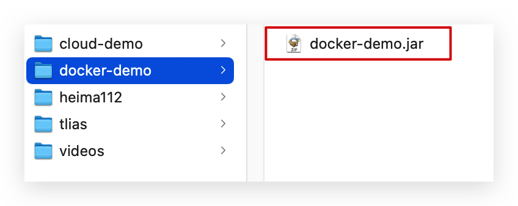

# Docker

## 常见问题

Docker如何解决大型项目依赖关系复杂，不同组件依赖的兼容性问题？

- Docker允许开发中将应用、依赖、函数库、配置一起**打包**，形成可移植镜像
- Docker应用运行在容器中，使用沙箱机制，相互**隔离**


Docker如何解决开发、测试、生产环境有差异的问题？

- Docker镜像中包含完整运行环境，包括系统函数库，仅依赖系统的Linux内核，因此可以在任意Linux操作系统上运行


Docker是一个快速交付应用、运行应用的技术，具备下列优势：

- 可以将程序及其依赖、运行环境一起打包为一个镜像，可以迁移到任意Linux操作系统
- 运行时利用沙箱机制形成隔离容器，各个应用互不干扰
- 启动、移除都可以通过一行命令完成，方便快捷


Docker和虚拟机的区别？

- docker是一个系统进程；虚拟机是在操作系统中的操作系统

- docker体积小、启动速度快、性能好；虚拟机体积大、启动速度慢、性能一般


## 基础架构

**镜像（Image）**：Docker将应用程序及其所需的依赖、函数库、环境、配置等文件打包在一起，称为镜像。

**容器（Container）**：镜像中的应用程序运行后形成的进程就是**容器**，只是Docker会给容器进程做隔离，对外不可见。

Docker是一个CS架构的程序，由两部分组成：

- 服务端(server)：Docker守护进程，负责处理Docker指令，管理镜像、容器等

- 客户端(client)：通过命令或RestAPI向Docker服务端发送指令。可以在本地或远程向服务端发送指令。

## 镜像源

国内也有类似于DockerHub 的公开服务，比如 [网易云镜像服务](https://c.163yun.com/hub)、[阿里云镜像库](https://cr.console.aliyun.com/)等。

## 基本指令

### 镜像操作

> 拉取

```shell
docker pull 镜像名：版本号
```

> 查看

```shell
docker images
```

> 保存

```shell
docker save -o [保存的目标文件名称] [镜像名称]
```

> 加载

```shell
docker load -i [镜像文件]
```

> 删除

```shell
docker rmi [镜像名称]：[版本]
```


### 容器操作

容器保护三个状态：

- 运行：进程正常运行
- 暂停：进程暂停，CPU不再运行，并不释放内存
- 停止：进程终止，回收进程占用的内存、CPU等资源

> 创建并运行
>
> - docker run ：创建并运行一个容器
> - --name : 给容器起一个名字，比如叫做mn
> - -p ：将宿主机端口与容器端口映射，冒号左侧是宿主机端口，右侧是容器端口
> - -d：后台运行容器
> - nginx：镜像名称，例如nginx

```
docker run --name [容器名称] -p 80:80 -d nginx
```

> 暂停

```
docker pause
```

> 让容器从暂停状态恢复运行

```
docker unpause
```

> 停止

```
docker stop
```

> 让停止的容器再次运行

```
docker start
```

> 删除

```
docker rm
```

> 进入容器
>
> - docker exec ：进入容器内部，执行一个命令
>
> - -it : 给当前进入的容器创建一个标准输入、输出终端，允许我们与容器交互
>
> - bash：进入容器后执行的命令，bash是一个linux终端交互命令

```
docker exec -it [容器名称] bash
```

> 查看容器日志

```
docker logs
docker logs -f 可以持续查看日志
```

> 查看容器状态

```
- docker ps
- docker ps -a 查看所有容器，包括已经停止的
```

### 数据卷

**数据卷（volume）**是一个虚拟目录，指向宿主机文件系统中的某个目录。

默认位于 `/var/lib/docker/volumes` 

> 创建数据卷

```
docker volume create [数据卷名称]
```

> 查看所有数据卷

```
docker volume ls
```

> 查看数据卷详细信息卷

```
docker volume inspect [数据卷名称]
```

> 删除所有未使用的数据卷

```
docker volume prune
```

> 删除指定数据卷

```sh
docker volume rm [数据卷名称]
```

> 挂载数据卷  -v

```
docker run -d -it --name [容器名称] -v html:/usr/share/nginx/html -p 82:80 -d [镜像名称]
```

> 挂载数据卷  --mount

```
docker run -d -it --name=[容器名称 -p 8011:80 --mount source=[自定义卷名],target=[目标卷名] [镜像名称]
```

#### `-v` 和 `--mount` 有什么区别？

都是挂载命令，使用 `-v` 挂载时，如果宿主机上没有指定文件不会报错，会自动创建指定文件；当使用 `--mount`时，如果宿主机中没有这个文件会报错找不到指定文件，不会自动创建指定文件。

> 进入html数据卷所在位置，并修改HTML内容

```sh
# 查看html数据卷的位置
docker volume inspect html
# 进入该目录
cd /var/lib/docker/volumes/html/_data
# 修改文件
vi index.html
```


## Dockerfile自定义镜像

### 镜像结构

镜像是将应用程序及其需要的系统函数库、环境、配置、依赖打包而成。


### Dockerfile语法

**Dockerfile**就是一个文本文件，其中包含一个个的**指令(Instruction)**，用指令来说明要执行什么操作来构建镜像。每一个指令都会形成一层**Layer**。


官网文档： https://docs.docker.com/engine/reference/builder

例：基于Ubuntu镜像构建一个新镜像，运行一个java项目

1. 步骤1：新建一个空文件夹docker-demo

   

2. 拷贝课前资料中的docker-demo.jar文件到docker-demo这个目录

   

3. 拷贝课前资料中的jdk8.tar.gz文件到docker-demo这个目录

   

4. 拷贝课前资料提供的Dockerfile到docker-demo这个目录

   

   ```sh
   # 指定基础镜像
   FROM ubuntu:16.04
   # 配置环境变量，JDK的安装目录
   ENV JAVA_DIR=/usr/local
   
   # 拷贝jdk和java项目的包
   COPY ./jdk8.tar.gz $JAVA_DIR/
   COPY ./docker-demo.jar /tmp/app.jar
   
   # 安装JDK
   RUN cd $JAVA_DIR \
    && tar -xf ./jdk8.tar.gz \
    && mv ./jdk1.8.0_144 ./java8
   
   # 配置环境变量
   ENV JAVA_HOME=$JAVA_DIR/java8
   ENV PATH=$PATH:$JAVA_HOME/bin
   
   # 暴露端口
   EXPOSE 8090
   # 入口，java项目的启动命令
   ENTRYPOINT java -jar /tmp/app.jar
   ```

   

5. 进入docker-demo

   将准备好的docker-demo上传到虚拟机任意目录，然后进入docker-demo目录下

6. 运行命令：

   ```
   docker build -t javaweb:1.0 .
   ```

   

