# Express

## ◆ 初识 Express 

### **1. Express 简介**

#### **1.1**. 什么是 Express

类似Node.js 内置的 http 模块，是专门用来创建 Web 服务器的

Express 的中文官网： http://www.expressjs.com.cn/

#### 1.2 Express作用

- Web 网站服务器：专门对外提供 Web 网页资源的服务器
- API 接口服务器：专门对外提供 API 接口的服务器


### **2. Express 的基本使用**

#### 2.1 **安装**

> npm i express

#### 2.2 **创建基本的 Web 服务器**

```js
const express = require('express')

const app = express()

app.listen(80, () => {
    console.log('http://localhost:80')
})
```

#### 2.3 **监听** **GET 请求** 

```js
//监听get请求
// 参数1：路径
// 参数2：回调函数
app.get('/', (req, res) => {
    res.send('hello world')
});
```

#### 2.4 **监听** **post 请求** 

```js
//监听post请求
app.post('/', (req, res) => {
    res.send('post请求')
});
```

#### 2.5 **获取 URL 中携带的查询参数**

1. **req.query** 对象，可以访问到客户端通过查询字符串的形式发送的参数：

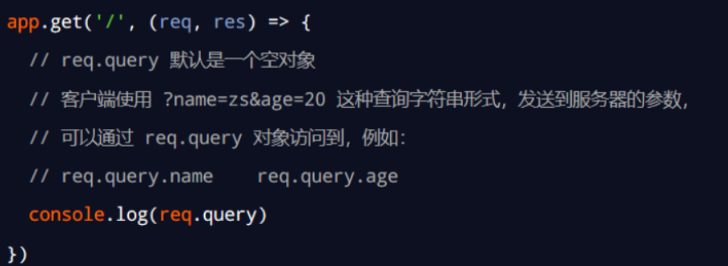


2. 通过 **req.params** 对象，可以访问到 URL 中，通过 **:** 匹配到的动态参数：

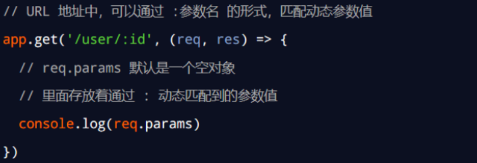


### **3. 托管静态资源**

#### 3.1. express.static() 

通过**express.static()** ，可以创建一个静态资源服务器。

例如，通过如下代码就可以将 public 目录下的图片、CSS 文件、JavaScript 文件对外开放访问了： 

```js
app.user(express.static('public'))
```

> 静态资源：
>
> http://localhost:3000/images/bg.jpg 
>
> http://localhost:3000/css/style.css 
>
> http://localhost:3000/js/login.js 

**注意：**Express 在指定的静态目录中查找文件，并对外提供资源的访问路径。 

因此，存放静态文件的目录名不会出现在 URL 中。

#### **3.2. 托管多个静态资源目录** 

多次调用express.static即可

express.static() 函数会根据目录的添加顺序查找所需的文件

```js
app.user(express.static('public'))
app.user(express.static('files'))
```

#### 3.3 **挂载路径前缀** 

在托管的静态资源访问路径之前，挂载路径前缀

```
app.user('/public',express.static('public'))
```

> 即可访问静态资源
>
> http://localhost:3000/public/images/kitten.jpg 
>
> http://localhost:3000/public/css/style.css 
>
> http://localhost:3000/public/js/app.js


### **4. nodemon** 

够监听项目文件的变动，当代码被修改后，nodemon 自动重启项目，极大方便了开发和调试。

nodemon（https://www.npmjs.com/package/nodemon）

安装

> npm i -g nodemon

使用

> nodemon app.js


## ◆ Express 路由 

### **1. 路由的概念** 

​	在 Express 中，路由指的是**客户端的请求**与**服务器处理函数**之间的映射关系。 

​	Express 中的路由分 3 部分组成，**请求的类型**、**请求的 URL 地址**、**处理函数**

### 2. 路由的匹配过程

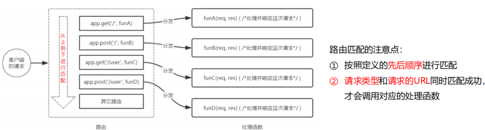

每当一个请求到达服务器之后，需要先经过路由的匹配

### 3. 路由模块化

① 创建路由模块对应的 .js 文件 

② 调用 express.Router() 函数创建路由对象 

③ 向路由对象上挂载具体的路由 

④ 使用 module.exports 向外共享路由对象 

⑤ 使用 app.use() 函数注册路由模块

> 创建路由

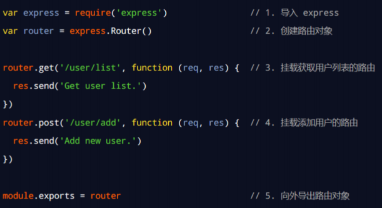

> 注册路由

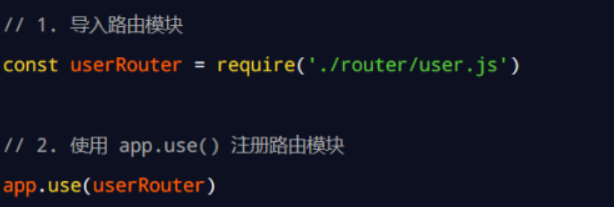

> 路由模块添加前缀

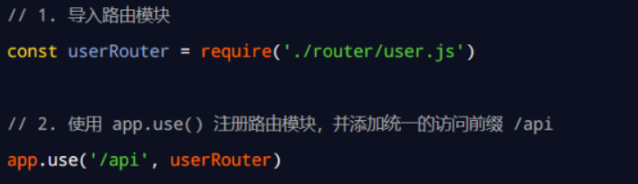


## ◆ Express 中间件 

**中间件**（Middleware ），特指业务流程的中间处理环节。

### 1.Express 中间件的格式

Express 的中间件，本质上就是一个 **function 处理函数**，Express 中间件的格式如下： 

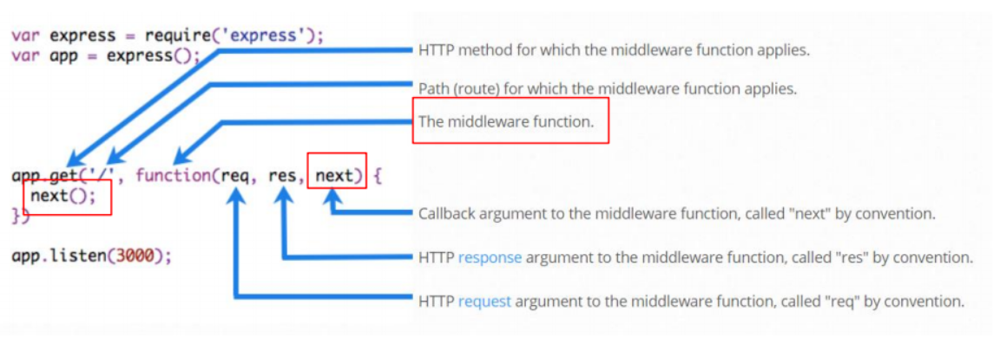

注意：中间件函数的形参列表中，必须包含 next 参数。而路由处理函数中只包含 req 和 res。

### 2. next函数的作用

**next 函数**是实现多个中间件连续调用的关键，它表示把流转关系转交给下一个中间件或路由。

### 3. 定义中间件函数

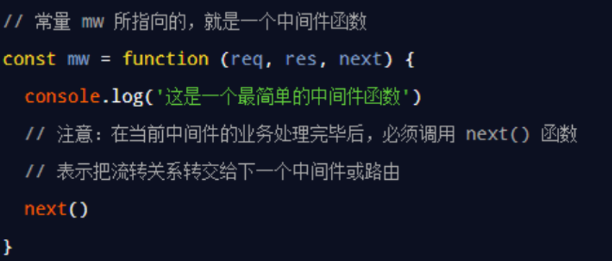

### 4.**全局生效**的中间件 

客户端发起的任何请求，到达服务器之后，都会触发的中间件，叫做全局生效的中间件。

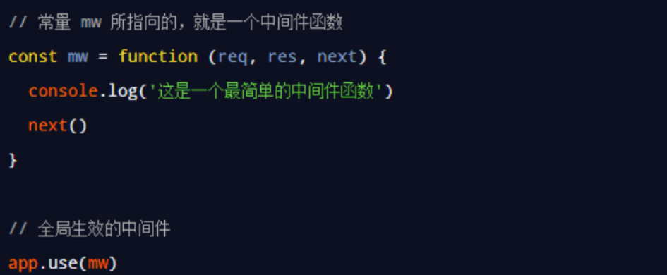

> 简化形式

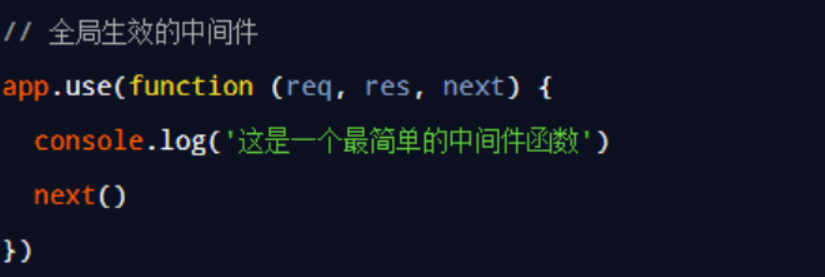

### 5. **中间件的**作用

多个中间件之间，**共享同一份** **req** **和** **res**。

**全局中间件**：以使用 app.use() 连续定义多个全局中间件

**局部生效的中间件** ：**不使用** app.use() 定义的中间件，叫做局部生效的中间件

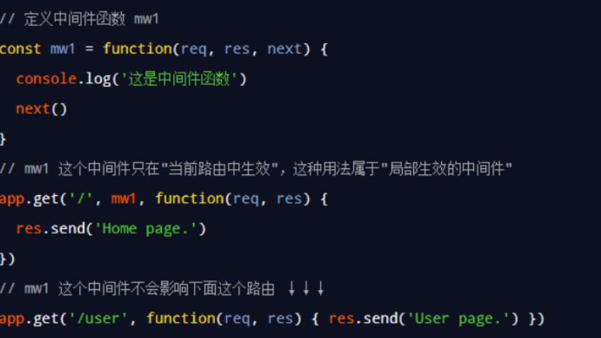

**定义多个局部中间件**：

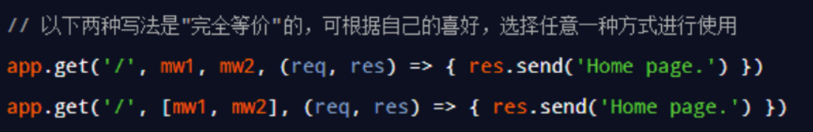

### 6.**中间件的**注意事项

> ① 一定要在路由之前注册中间件 
>
> ② 客户端发送过来的请求，可以连续调用多个中间件进行处理 
>
> ③ 执行完中间件的业务代码之后，不要忘记调用 next() 函数 
>
> ④ 为了防止代码逻辑混乱，调用 next() 函数后不要再写额外的代码 
>
> ⑤ 连续调用多个中间件时，多个中间件之间，共享 req 和 res 对象

### 7.**中间件的分类** 

① 应用级别的中间件 

- 绑定到 app 实例上的中间件    app.use() 或 app.get() 或 app.post()

② 路由级别的中间件 

- 绑定到 express.Router() 实例上的中间件

③ 错误级别的中间件 

- 捕获整个项目中发生的异常错误，从而防止项目异常崩溃的问题。 
- 有 4 个形参，形参顺序从前到后，分别是 (err, req, res, next)。 

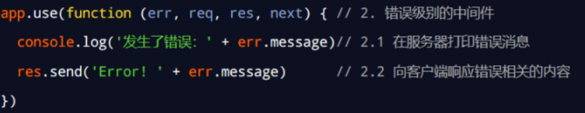

**注意：**错误级别的中间件， 必须注册在所有路由之后！

④ Express 内置的中间件 

- express.static 快速托管静态资源的内置中间件，例如： HTML 文件、图片、CSS 样式等（无兼容性） 
- express.json 解析 JSON 格式的请求体数据（有兼容性，仅在 4.16.0+ 版本中可用） 
- express.urlencoded 解析 URL-encoded 格式的请求体数据（有兼容性，仅在 4.16.0+ 版本中可用）

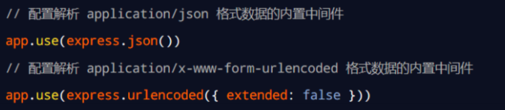

⑤ 第三方的中间件

​	

## ◆ **CORS 跨域资源共享**

### 1.  接口的跨域问题 

浏览器安全的基石是「同源策略」（same-origin policy）。同源即：

- 协议相同
- 域名（主机名）相同
- 端口相同

 一个源访问另一个源的资源时即为「跨源」，最常见的跨源场景是域名不同，即常说的“跨域”。 

> [解决方案：](https://zhuanlan.zhihu.com/p/260182075)
>
> - JSONP（JSON with Padding）（只支持get请求）
> - CORS（Cross-Origin Resource Sharing）
> - Websocket
> - 在 nginx 等反向代理服务器中设置为同一域名

### 2. **使用** **cors 中间件**解决跨域问题

> 使用步骤：
>
> ​	① 运行 npm install cors 安装中间件 
>
> ​	② 使用 const cors = require('cors') 导入中间件 
>
> ​	③ 在路由之前调用 app.use(cors()) 配置中间件

### **3**. 什么是 CORS

CORS （Cross-Origin Resource Sharing，跨域资源共享）由一系列 HTTP 响应头组成，**这些 HTTP 响应头决定浏览器是否阻止前端 JS 代码跨域获取资源。**

浏览器的**同源安全策略**默认会阻止网页“跨域”获取资源。但如果接口服务器配置了 CORS 相关的 HTTP 响应头， 就可以解除浏览器端的跨域访问限制。

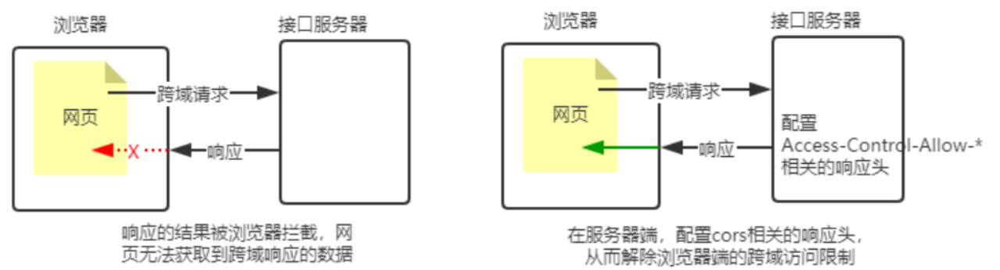

### 4. CORS 的注意事项

① CORS 主要在**服务器端**进行配置。客户端浏览器**无须做任何额外的配置**，即可请求开启了 CORS 的接口。 

② CORS 在浏览器中**有兼容性**。只有支持 XMLHttpRequest Level2 的浏览器，才能正常访问开启了 CORS 的服 务端接口（例如：IE10+、Chrome4+、FireFox3.5+）。

### 5. CORS 响应头部

#### 5.1 Access-Control-Allow-Origin

```
res.setHeader('Access-Control-Allow-Origin', '*')
```

origin 参数的值指定了允许访问该资源的外域 URL。

#### 5.2 Access-Control-Allow-Headers

默认情况下，CORS 仅支持客户端向服务器发送如下的 9 个请求头： 

Accept、Accept-Language、Content-Language、DPR、Downlink、Save-Data、Viewport-Width、Width 、 Content-Type （值仅限于 text/plain、multipart/form-data、application/x-www-form-urlencoded 三者之一） 

如果客户端向服务器发送了额外的请求头信息，则需要在服务器端，通过 Access-Control-Allow-Headers 对额外的请求头进行声明，否则这次请求会失败！

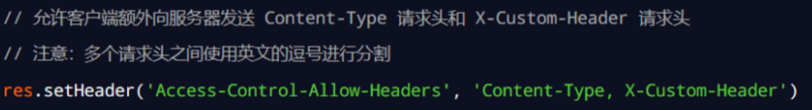

#### 5.3 Access-Control-Allow-Methods

默认情况下，CORS 仅支持客户端发起 GET、POST、HEAD 请求。 

如果客户端希望通过 PUT、DELETE 等方式请求服务器的资源，则需要在服务器端，通过 Access-Control-Alow-Methods指明实际请求允许使用的 HTTP 方法。 

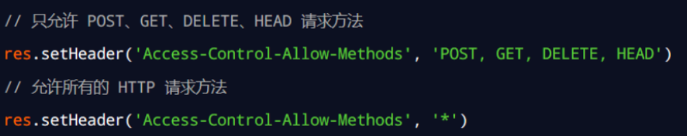

### 6. CORS请求的分类

客户端在请求 CORS 接口时，根据请求方式和请求头的不同，可以将 CORS 的请求分为两大类，分别是： 

① 简单请求 

② 预检请求

#### 6.1 **简单请求**

同时满足以下两大条件的请求，就属于简单请求： 

① 请求方式：GET、POST、HEAD 三者之一 

② HTTP 头部信息不超过以下几种字段：无自定义头部字段、Accept、Accept-Language、Content-Language、DPR、 Downlink、Save-Data、Viewport-Width、Width 、Content-Type（只有三个值application/x-www-formurlencoded、multipart/form-data、text/plain）

#### 6.2 预检请求

只要符合以下任何一个条件的请求，都需要进行预检请求： 

① 请求方式为 GET、POST、HEAD 之外的请求 Method 类型 

② 请求头中包含自定义头部字段 

③ 向服务器发送了 application/json 格式的数据 

在浏览器与服务器正式通信之前，浏览器会先发送 OPTION 请求进行预检，以获知服务器是否允许该实际请求，所以这一 次的 OPTION 请求称为“预检请求”。服务器成功响应预检请求后，才会发送真正的请求，并且携带真实数据。

#### 6.3 请求和预检请求的区别

简单请求：客户端与服务器之间只会发生一次请求。

预检请求：客户端与服务器之间会发生两次请求，OPTION 预检请求成功之后，才会发起真正的请求。

### 7. JSONP 接口

#### 7.1 JSONP 的概念与特点

概念：浏览器端通过 <script> 标签的 src 属性，请求服务器上的数据，同时，服务器返回一个函数的调用。这种请求数据 的方式叫做 JSONP。

特点： 

① JSONP 不属于真正的 Ajax 请求，因为它没有使用 XMLHttpRequest 对象。 

② JSONP 仅支持 GET 请求，不支持 POST、PUT、DELETE 等请求。

#### 7.2. 创建 JSONP 接口的注意事项

如果项目中已经配置了 CORS 跨域资源共享，为了**防止冲突**，必须在配置 CORS 中间件之前声明 JSONP 的接口。否则 JSONP 接口会被处理成开启了 CORS 的接口。示例代码如下：

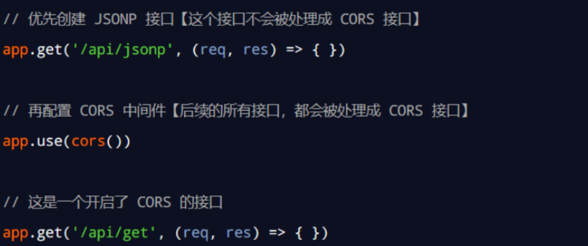

#### 7.3. 实现 JSONP 接口的步骤

① 获取客户端发送过来的回调函数的名字 

② 得到要通过 JSONP 形式发送给客户端的数据 

③ 根据前两步得到的数据，拼接出一个函数调用的字符串 

④ 把上一步拼接得到的字符串，响应给客户端的 <script> 标签进行解析执行

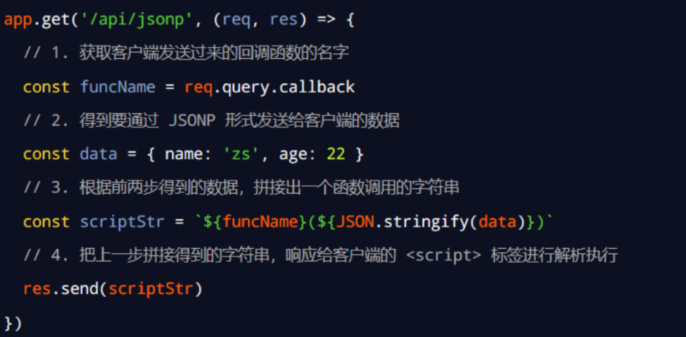

#### 7.5. 发起 JSONP 请求

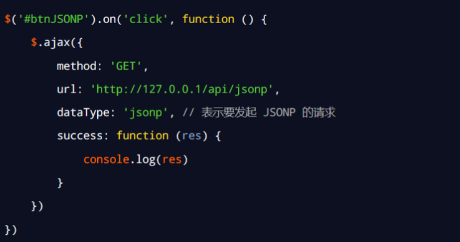

