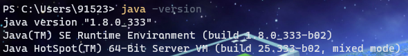

## windows系统

### 1. 下载安装

1. 打开[Java官网](https://www.java.com/zh-CN/)，点击下载按钮，下载安装包。(Java SE 8u131版本)，
   或者直接点击[这里](https://www.oracle.com/java/technologies/downloads/#java8)下载8及以上版本的安装包。
2. 双击安装包，按照提示安装即可。
3. 安装完成后，打开命令行，输入`java -version`，如果出现Java版本信息，则表示安装成功。
   

或者使用以下命令安装Java：

```shell
choco install jdk11
```

> 注意：需要先安装Chocolatey包管理工具，具体安装方法请参考[Chocolatey包管理工具](../运维/windows/Chocolatey包管理工具.md)。

### 2. 配置环境变量

1. 打开`我的电脑`，右键点击`属性`，选择`高级系统设置`。
2. 在弹出的窗口中，选择`高级`选项卡，点击`环境变量`。
3. 在弹出的窗口中，选择`系统变量`，找到`Path`，双击`Path`，在弹出的窗口中，点击`新建`
   ，输入`C:\Program Files\Java\jdk1.8.0_131\bin`，点击`确定`。
   > 注意：`C:\Program Files\Java\jdk1.8.0_131\bin`是你的Java安装路径，需要根据自己的实际情况进行修改。
4. 重启命令行，输入`java -version`，如果出现Java版本信息，则表示配置成功。
5. 如果出现`java is not recognized as an internal or external command`，则表示配置失败，需要重新检查配置环境变量。

或者使用以下命令配置环境变量：

```shell
setx path "%path%;C:\Program Files\Java\jdk1.8.0_131\bin"
```

> 注意：`C:\Program Files\Java\jdk1.8.0_131\bin`是你的Java安装路径，需要根据自己的实际情况进行修改。

## centos系统

### 1. 下载安装

1. 首先打开终端，使用以下命令下载并安装OpenJDK：
    
    ```shell
    sudo yum install java-1.8.0-openjdk
    ```
2. 确认Java是否安装成功：
    
    ```shell
    java -version
    ```
如果出现Java版本信息，则表示安装成功。

### 2. 配置环境变量

1. 打开`/etc/profile`文件，使用以下命令：

   ```shell
   sudo vi /etc/profile
   ```

2. 在文件末尾添加以下代码：

   ```shell
   JAVA_HOME=/usr/lib/jvm/java-1.8.0-openjdk
   JRE_HOME=/usr/lib/jvm/java-1.8.0-openjdk/jre
   PATH=$PATH:$JAVA_HOME/bin:$JRE_HOME/bin
   export JAVA_HOME
   export JRE_HOME
   export PATH
   ```

3. 保存文件并执行以下命令使得变量生效：

   ```shell
   source /etc/profile
   ```

4. 执行以下命令测试Java是否正常运行：

   ```shell
   java -version
   ```

如果仍然能够看到Java版本信息，则说明环境变量配置成功。 ♨

## ubuntu系统

### 1. 下载安装

1. 首先打开终端，使用以下命令下载并安装OpenJDK：
    
    ```shell
    sudo apt-get install openjdk-8-jdk
    ```
2. 确认Java是否安装成功：
    
    ```shell
    java -version
    ```
   
如果出现Java版本信息，则表示安装成功。

### 2. 配置环境变量

1. 打开`/etc/profile`文件，使用以下命令：

   ```shell
   sudo vi /etc/profile
   ```
2. 在文件末尾添加以下代码：

   ```shell
    JAVA_HOME=/usr/lib/jvm/java-1.8.0-openjdk
    JRE_HOME=/usr/lib/jvm/java-1.8.0-openjdk/jre
    PATH=$PATH:$JAVA_HOME/bin:$JRE_HOME/bin
    export JAVA_HOME
    export JRE_HOME
    export PATH
    ```
3. 保存文件并执行以下命令使得变量生效：
4. 执行以下命令测试Java是否正常运行：

   ```shell
   java -version
   ```
   
如果仍然能够看到Java版本信息，则说明环境变量配置成功。 ♨

## mac系统
> 注意：mac系统自带Java，但是版本较低，需要升级Java版本。
> 
> 如果你的mac系统自带Java版本较高，可以跳过此步骤。
### 1. 下载安装

1. 打开[Java官网](https://www.java.com/zh-CN/)，点击下载按钮，下载安装包。(Java SE 8u131版本)，
   或者直接点击[这里](https://www.oracle.com/java/technologies/downloads/#java8)下载8及以上版本的安装包。
2. 双击安装包，按照提示安装即可。
3. 安装完成后，打开命令行，输入`java -version`，如果出现Java版本信息，则表示安装成功。

### 2. 配置环境变量

1. 打开`~/.bash_profile`文件，使用以下命令：

   ```shell
   vi ~/.bash_profile
   ```
2. 在文件末尾添加以下代码：

   ```shell
    export JAVA_HOME=$(/usr/libexec/java_home)
    export PATH=$PATH:$JAVA_HOME/bin
    ```
3. 保存文件并执行以下命令使得变量生效：
4. 执行以下命令测试Java是否正常运行：

   ```shell
   java -version
   ```
如果仍然能够看到Java版本信息，则说明环境变量配置成功。 ♨

> 暂无MAC系统，无法测试，如有错误，欢迎指正。

