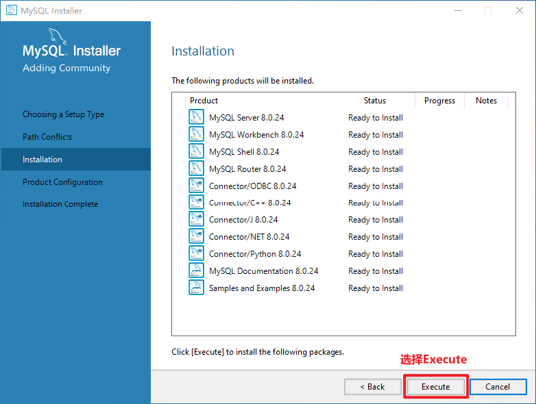

# MySQL

## 安装

### 1. 压缩包安装

在解压目录创建my.ini文件


```ini
[mysql]
#设置3306端口
port=3306
character-set-server=utf8
#创建新表时将使用的默认存储引擎
default-storage-engine=INNODB
[mysql]
# 设置mysql客户端默认字符集
default-character-set=utf8
[client]
#设置mysql客户端连接服务端时默认使用的端口
port=3306
default-character-set=utf8
```

配置系统环境


服务操作

使用管理员权限进入DOS，在cmd中，进入解压目录下的bin目录依次执行以下命令：

1.对mysql进行初始化，会生产一个临时密码，后边要使用这个临时密码

```sh
mysqld --initialize --user=mysql --console
```

2.安装mysql服务

```sh
mysqld --install
```

3.启动mysql服务

```sh
net start mysql
```

4.登录mysql，这里需要使用之前生产的临时密码

```sh
mysql -uroot –p [临时密码]
```

5.修改root用户密码

```sh
ALTER USER 'root'@'localhost' IDENTIFIED WITH mysql_native_password BY ‘123456’;
```

6.修改root用户权限

```sh
create user 'root'@'%' IDENTIFIED WITH mysql_native_password BY ‘123456';
```

### 2. 应用程序安装

下载地址：https://downloads.mysql.com/archives/installer/


此后按照流程安装即可，遇到`Next`（下一步）直接点击即可

点击`Execute`后需要等待几分钟。


当所有的状态都变成Complete之后，点击 `Next>`


此处输入密码用于之后登陆数据库，建议将密码设置为：123456;

### 3. docker安装

```sh
#镜像拉取
docker pull mysql

#启动
docker run --name mysql -p 3306:3306 -e MYSQL_ROOT_PASSWORD=123456 -d mysql

#进入容器
docker exec -it mysql bash

#登录mysql
mysql -u root -p
ALTER USER 'root'@'localhost' IDENTIFIED BY '123456';

#添加远程登录用户
CREATE USER 'root123'@'%' IDENTIFIED WITH mysql_native_password BY '123456';
GRANT ALL PRIVILEGES ON *.* TO 'root123'@'%';
```

## **数据类型**

### 数值类型

| **类型**            | **大小** | **范围（有符号）**                                           | **范围（无符号）**                                           | **用途**       |
| ------------------- | -------- | ------------------------------------------------------------ | ------------------------------------------------------------ | -------------- |
| **TINYINT**         | 1 byte   | (-128，127)                                                  | (0，255)                                                     | 小整数值       |
| **SMALLINT**        | 2 bytes  | (-32 768，32 767)                                            | (0，65 535)                                                  | 大整数值       |
| **MEDIUMINT**       | 3 bytes  | (-8 388 608，8 388 607)                                      | (0，16 777 215)                                              | 大整数值       |
| **INT**/**INTEGER** | 4 bytes  | (-2 147 483 648，2 147 483 647)                              | (0，4 294 967 295)                                           | 大整数值       |
| **BIGINT**          | 8 bytes  | (-9,223,372,036,854,775,808，9 223 372 036 854 775 807)      | (0，18 446 744 073 709 551 615)                              | 极大整数值     |
| **FLOAT**           | 4 bytes  | (-3.402 823 466 E+38，3.402 823 466 351 E+38)                | 0，(1.175 494 351 E-38，3.402 823 466 E+38)                  | 单精度浮点数值 |
| **DOUBLE**          | 8 bytes  | (-1.797 693 134 862 315 7 E+308，1.797 693 134 862 315 7 E+308) | 0，(2.225 073 858 507 201 4 E-308，1.797 693 134 862 315 7 E+308) | 双精度浮点数值 |
| **DECIMAL**         |          | 依赖于M和D的值                                               | 依赖于M和D的值                                               | 小数值         |

### 字符串类型

| **类型**       | **大小**              | **用途**                        |
| -------------- | --------------------- | ------------------------------- |
| **CHAR**       | 0-255 bytes           | 定长字符串                      |
| **VARCHAR**    | 0-65535 bytes         | 变长字符串                      |
| **TINYBLOB**   | 0-255 bytes           | 不超过 255 个字符的二进制字符串 |
| **TINYTEXT**   | 0-255 bytes           | 短文本字符串                    |
| **BLOB**       | 0-65 535 bytes        | 二进制形式的长文本数据          |
| **TEXT**       | 0-65 535 bytes        | 长文本数据                      |
| **MEDIUMBLOB** | 0-16 777 215 bytes    | 二进制形式的中等长度文本数据    |
| **MEDIUMTEXT** | 0-16 777 215 bytes    | 中等长度文本数据                |
| **LONGBLOB**   | 0-4 294 967 295 bytes | 二进制形式的极大文本数据        |
| **LONGTEXT**   | 0-4 294 967 295 bytes | 极大文本数据                    |

### 日期类型

| **类型**      | **大小**( bytes) | **范围**                                                     | **格式**            | **用途**                 |
| ------------- | ---------------- | ------------------------------------------------------------ | ------------------- | ------------------------ |
| **DATE**      | 3                | 1000-01-01/9999-12-31                                        | YYYY-MM-DD          | 日期值                   |
| **TIME**      | 3                | '-838:59:59'/'838:59:59'                                     | HH:MM:SS            | 时间值或持续时间         |
| **YEAR**      | 1                | 1901/2155                                                    | YYYY                | 年份值                   |
| **DATETIME**  | 8                | 1000-01-01 00:00:00/9999-12-31 23:59:59                      | YYYY-MM-DD HH:MM:SS | 混合日期和时间值         |
| **TIMESTAMP** | 4                | 1970-01-01 00:00:00/2038结束时间是第 2147483647 秒，北京时间 2038-1-19 11:14:07，格林尼治时间 2038年1月19日 凌晨 03:14:07 | YYYYMMDD HHMMSS     | 混合日期和时间值，时间戳 |

## 数据库基本操作

### DDL

> 数据定义语言(Data Definition Language)

#### 对数据库的常用操作

| 功能                       | **SQL**                                              |
| -------------------------- | ---------------------------------------------------- |
| 查看所有的数据库           | show databases；                                     |
| 创建数据库                 | create database [if not exists] mydb1 [charset=utf8] |
| 切换 (选择要操作的) 数据库 | use mydb1；                                          |
| 删除数据库                 | drop database [if exists] mydb1；                    |
| 修改数据库编码             | alter database mydb1 character set utf8;             |

#### 对表结构的常用操作

> **创建表**

```sql
--语法格式
create table [if not exists]表名(
  字段名1 类型[(宽度)] [约束条件] [comment '字段说明'],
  字段名2 类型[(宽度)] [约束条件] [comment '字段说明'],
  字段名3 类型[(宽度)] [约束条件] [comment '字段说明']
)[表的一些设置];

--例子
use mydb1;
create  table if not exists student(
    sid int,
    name varchar(20),
    gender varchar(20),
    age int,
    birth date, 
    address varchar(20),
    score double
);
```

> **修改表结构**

- 添加列

```sql
--语法格式
alter table 表名 add 列名 类型(长度) [约束];

--例子
#为student表添加一个新的字段为：系别 dept 类型为 varchar(20)
ALTER TABLE student ADD `dept` VARCHAR(20); 
```

- 修改列名和类型

```sql
--语法格式
alter table 表名 change 旧列名 新列名 类型(长度) 约束; 

--例子
#为student表的dept字段更换为department varchar(30)
ALTER TABLE student change `dept` department VARCHAR(30); 
```

- 删除列

```sql
--语法格式
alter table 表名 drop 列名;

--例子
#删除student表中department这列
ALTER TABLE student DROP department;
```

- 修改表名

```sql
--语法格式
rename table 表名 to 新表名;

--例子
#将表student改名成 stu
rename table `student`  to stu;
```

> **其他操作**

| 功能                       | **SQL**                  |
| -------------------------- | ------------------------ |
| 查看当前数据库的所有表名称 | show tables;             |
| 查看指定某个表的创建语句   | show create table 表名； |
| 查看表结构                 | desc 表名                |
| 删除表                     | drop table 表名          |

### DML

> 指数据操作语言，英文全称是Data Manipulation Language；

#### insert

```sql
--向表中插入某些
insert into 表 (列名1,列名2,列名3...) values (值1,值2,值3...);
--向表中插入所有列
insert into 表 values (值1,值2,值3...); 
```

```sql
insert into student(sid,name,gender,age,birth,address,score) 
values(1001,'男',18,'1996-12-23','北京',83.5);

insert into student values(1001,'男',18,'1996-12-23','北京',83.5);
```

#### update

```sql
update 表名 set 字段名=值,字段名=值...;
update 表名 set 字段名=值,字段名=值... where 条件;
```

```sql
-- 将所有学生的地址修改为重庆 
update student set address = '重庆’; 

--讲id为1004的学生的地址修改为北京 
update student set address = '北京' where id = 1004;

--讲id为1005的学生的地址修改为北京，成绩修成绩修改为100 
update student set address = '广州',score=100 where id = 1005
```

#### delete

```sql
delete from 表名 [where 条件];
truncate table  表名 或者 truncate 表名
```

```sql
-- 1.删除sid为1004的学生数据
delete from student where sid  = 1004;

-- 2.删除表所有数据
delete from student;

-- 3.清空表数据
truncate table student;
truncate student;
```

> **注意**：delete和truncate原理不同，delete只删除内容，而truncate类似于drop table ，可以理解为是将整个表删除，然后再创建该表；


## MySQL约束

作用: 为了保证表中的记录完整性和有效性

### 主键约束(primary key) PK

#### 概念

- MySQL主键约束是一个列或者多个列的组合，其值能唯一地标识表中的每一行,方便在`RDBMS`中尽快的找到某一行。
- 主键约束相当于 唯一约束 + 非空约束 的组合，主键约束列不允许重复，也不允许出现空值。
- 每个表最多只允许一个主键
- 主键约束的关键字是：`primary key`
- 当创建主键的约束时，系统默认会在所在的列和列组合上建立对应的唯一索引。

### 自增长约束(auto_increment)


### 非空约束(not null)


### 唯一性约束(unique)


### 默认约束(default)


### 零填充约束(zerofill)


### 外键约束(foreign key) FK