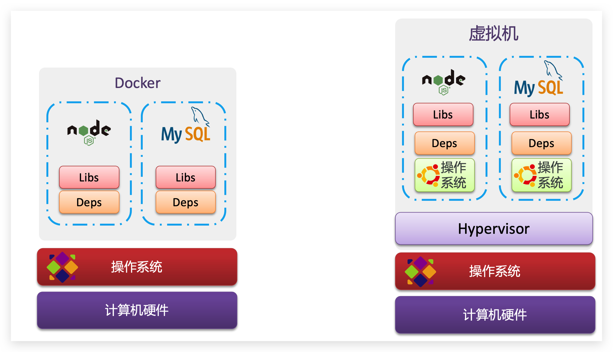
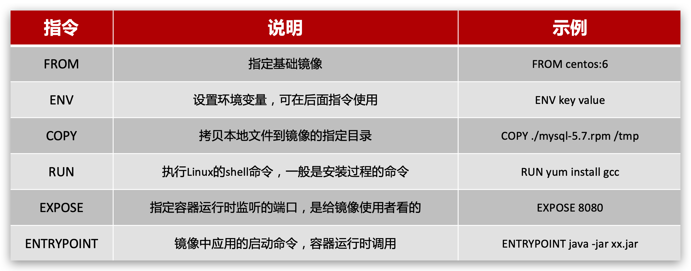

## 常见问题

### Docker如何解决大型项目依赖关系复杂，不同组件依赖的兼容性问题？

- Docker允许开发中将应用、依赖、函数库、配置一起**打包**，形成可移植镜像
- Docker应用运行在容器中，使用沙箱机制，相互**隔离**

> 什么是沙箱机制？
> 沙箱机制是一种隔离机制，可以将一个进程的运行环境与宿主机的运行环境隔离开来，使得进程运行在一个“沙箱”中，对宿主机的运行环境没有任何影响。

### Docker如何解决开发、测试、生产环境有差异的问题？

- Docker镜像中包含完整运行环境，包括系统函数库，仅依赖系统的Linux内核，因此可以在任意Linux操作系统上运行

### Docker具备哪些优势？

- 可以将程序及其依赖、运行环境一起打包为一个镜像，可以迁移到任意Linux操作系统
- 运行时利用沙箱机制形成隔离容器，各个应用互不干扰
- 启动、移除都可以通过一行命令完成，方便快捷

### Docker和虚拟机的区别？

- docker是一个系统进程；虚拟机是在操作系统中的操作系统

- docker体积小、启动速度快、性能好；虚拟机体积大、启动速度慢、性能一般



## 1. 基础架构

**镜像（Image）**：Docker将应用程序及其所需的依赖、函数库、环境、配置等文件打包在一起，称为镜像。

**容器（Container）**：镜像中的应用程序运行后形成的进程就是**容器**，只是Docker会给容器进程做隔离，对外不可见。

Docker是一个CS架构的程序，由两部分组成：

- 服务端(server)：Docker守护进程，负责处理Docker指令，管理镜像、容器等

- 客户端(client)：通过命令或RestAPI向Docker服务端发送指令。可以在本地或远程向服务端发送指令。

## 2. 安装

### 2.1. 安装Docker的前置条件

在安装Docker之前，需要先安装Linux的一些前置条件，包括Linux内核版本3.10以上、iptables版本1.4以上、以及curl和ipset。

以CentOS 7为例，可以使用以下命令来安装前置条件：

```
sudo yum install -y yum-utils device-mapper-persistent-data lvm2
sudo yum-config-manager --add-repo https://download.docker.com/linux/centos/docker-ce.repo
```

### 2.2. 安装Docker

可以使用以下命令来安装Docker：

```
sudo yum install docker-ce docker-ce-cli containerd.io
```

如果需要安装特定版本的Docker，可以使用以下命令：

```
sudo yum install docker-ce-<VERSION_STRING> docker-ce-cli-<VERSION_STRING> containerd.io
```

### 2.3. 启动Docker

安装完成后，可以使用以下命令来启动Docker：

```
sudo systemctl start docker
```

可以使用以下命令来检查Docker是否已启动：

```
sudo systemctl status docker
```

如果Docker未启动，可以使用以下命令来启动：

```
sudo systemctl start docker
```

### 2.4. 测试Docker安装是否成功

可以使用以下命令来测试Docker是否已成功安装：

```
sudo docker run hello-world
```

### 2.5. 设置Docker自启动

可以使用以下命令来设置Docker在系统启动时自动启动：

```
sudo systemctl enable docker
```

### 2.6. 配置Docker镜像加速器

由于Docker官方镜像在国内访问速度较慢，可以使用阿里云的镜像加速器来加速Docker镜像的下载速度。

可以使用以下命令来配置Docker镜像加速器：

```
sudo mkdir -p /etc/docker
sudo tee /etc/docker/daemon.json <<-'EOF'
{
  "registry-mirrors": ["https://ty1kjal3.mirror.aliyuncs.com"]
}
EOF
sudo systemctl daemon-reload
sudo systemctl restart docker
```

验证Docker镜像加速器是否配置成功

```
sudo docker info
```

## 3. 基本指令

### 3.1 镜像操作

- 拉取

```shell
docker pull 镜像名:版本
```

- 查看

```shell
docker images
```

- 保存

```shell
docker save -o [保存的目标文件名称] [镜像名称]
```

- 加载

```shell
docker load -i [镜像文件]
```

- 删除

```shell
docker rmi [镜像名称]：[版本]
```

### 3.2 容器操作

容器保护三个状态：

> - 运行：进程正常运行
> - 暂停：进程暂停，CPU不再运行，并不释放内存
> - 停止：进程终止，回收进程占用的内存、CPU等资源

- 创建并运行

>
> - docker run ：创建并运行一个容器
> - --name : 给容器起一个名字，比如叫做mn
> - -p ：将宿主机端口与容器端口映射，冒号左侧是宿主机端口，右侧是容器端口;
> - -v：将宿主机目录与容器目录映射，冒号左侧是宿主机目录，右侧是容器目录;如果宿主机目录不存在，会自动创建
> - -e：设置环境变量
> - -d：后台运行容器
> - [镜像名称]：要运行的镜像名称

```
docker run --name [容器名称] -p [宿主机端口]:[容器端口] -v [宿主机目录]:[容器目录] -e [环境变量] -it [镜像名称]:[版本]
```

- 暂停

```
docker pause
```

- 让容器从暂停状态恢复运行

```
docker unpause
```

- 停止

```
docker stop

```

- 让停止的容器再次运行

```
docker start

```

- 删除

```
docker rm

```

- 进入容器

> - docker exec ：进入容器内部，执行一个命令
>
> - -it : 给当前进入的容器创建一个标准输入、输出终端，允许我们与容器交互
>
> - bash：进入容器后执行的命令，bash是一个linux终端交互命令

```
docker exec -it [容器名称] bash

```

- 查看容器日志

```
docker logs
docker logs -f 可以持续查看日志

```

- 查看容器状态

```
- docker ps
- docker ps -a 查看所有容器，包括已经停止的

```

### 3.3 数据卷

**数据卷（volume** 是一个虚拟目录，指向宿主机文件系统中的某个目录。

默认位于 `/var/lib/docker/volumes`

- 创建数据卷

```
docker volume create [数据卷名称]

```

- 查看所有数据卷

```
docker volume ls

```

- 查看数据卷详细信息卷

```
docker volume inspect [数据卷名称]

```

- 删除所有未使用的数据卷

```
docker volume prune

```

- 删除指定数据卷

```sh
docker volume rm [数据卷名称]

```

- 挂载数据卷 -v

```
docker run -d -it --name [容器名称] -v html:/usr/share/nginx/html -p 82:80 -d [镜像名称]

```

- 挂载数据卷 --mount

```
docker run -d -it --name=[容器名称 -p 8011:80 --mount source=[自定义卷名],target=[目标卷名] [镜像名称]

```

**`-v` 和 `--mount` 有什么区别？**

都是挂载命令，使用 `-v` 挂载时，如果宿主机上没有指定文件不会报错，会自动创建指定文件；当使用 `--mount`
时，如果宿主机中没有这个文件会报错找不到指定文件，不会自动创建指定文件。

- 进入html数据卷所在位置，并修改HTML内容

```sh
# 查看html数据卷的位置
docker volume inspect html
# 进入该目录
cd /var/lib/docker/volumes/html/_data
# 修改文件
vi index.html

```

## 4. Dockerfile自定义镜像

### 镜像结构

镜像是将应用程序及其需要的系统函数库、环境、配置、依赖打包而成。


### Dockerfile语法

**Dockerfile**就是一个文本文件，其中包含一个个的**指令(Instruction)**，用指令来说明要执行什么操作来构建镜像。每一个指令都会形成一层
**Layer**。



官网文档： https://docs.docker.com/engine/reference/builder

### 各类软件安装

#### MySQL

```shell
docker run -p 3306:3306 
--name mysql
-v /usr/local/gourd/docker/mysql/conf:/etc/mysql/conf.d
-v /usr/local/gourd/docker/mysql/logs:/logs
-e TZ="Asia/Shanghai"
-e MYSQL_ROOT_PASSWORD=[密码]
-d mysql:[版本]
--restart=always
--character-set-server=utf8mb4 # 设置字符集
--collation-server=utf8mb4_unicode_ci # 设置字符集排序规则
--
```

#### Redis

```shell
docker run -p 6379:6379
--name redis
-v /usr/local/gourd/docker/redis/conf/redis.conf:/etc/redis/redis.conf
-v /usr/local/gourd/docker/redis/data:/data
-e TZ="Asia/Shanghai"
-d redis:[版本] redis-server /etc/redis/redis.conf
--restart=always
--appendonly yes
--requirepass [密码] # 设置密码
--daemonize no # 后台运行
--protected-mode no # 关闭保护模式
```

#### MongoDB

```shell
docker run -p 27017:27017
--name mongo
-v /usr/local/gourd/docker/mongo/conf/mongod.conf:/etc/mongod.conf
-v /usr/local/gourd/docker/mongo/data:/data/db
-e TZ="Asia/Shanghai"
-d mongo:[版本] mongod -f /etc/mongod.conf
--restart=always
--auth # 开启认证
--bind_ip_all # 绑定所有IP
--dbpath /data/db # 数据库路径
--logpath /data/db/mongodb.log # 日志路径
--logappend # 追加日志
--fork # 后台运行
```

#### Nginx

```shell
docker run -p 80:80
--name nginx
-v /usr/local/gourd/docker/nginx/conf/nginx.conf:/etc/nginx/nginx.conf 
-v /usr/local/gourd/docker/nginx/logs:/var/log/nginx
-v /usr/local/gourd/docker/nginx/html:/usr/share/nginx/html
-v /usr/local/gourd/docker/nginx/cert:/etc/nginx/cert 
-e TZ="Asia/Shanghai"
-d nginx:[版本]
--restart=always
--daemon off # 前台运行
--conf-path /etc/nginx/nginx.conf # 配置文件路径
--error-log-path /var/log/nginx/error.log # 错误日志路径
--http-log-path /var/log/nginx/access.log # 访问日志路径
--pid-path /var/run/nginx.pid # pid文件路径
--lock-path /var/run/nginx.lock # 锁文件路径
--with-http_stub_status_module # 开启状态模块
--with-http_ssl_module # 开启SSL模块
--with-http_gzip_static_module # 开启gzip模块
```

#### Elasticsearch

```shell
docker run -p 9200:9200
--name elasticsearch
-v /usr/local/gourd/docker/elasticsearch/conf/elasticsearch.yml:/usr/share/elasticsearch/config/elasticsearch.yml
-v /usr/local/gourd/docker/elasticsearch/data:/usr/share/elasticsearch/data
-v /usr/local/gourd/docker/elasticsearch/logs:/usr/share/elasticsearch/logs
-v /usr/local/gourd/docker/elasticsearch/plugins:/usr/share/elasticsearch/plugins
-e TZ="Asia/Shanghai"
-d elasticsearch:[版本]
--restart=always
--cluster.name=[集群名称] # 集群名称
--node.name=[节点名称] # 节点名称
--node.master=true # 是否为主节点
--node.data=true # 是否为数据节点
--bootstrap.memory_lock=true # 内存锁定
--network.host=
--http.port=9200 # HTTP端口
--discovery.zen.ping.unicast.hosts=[节点1],[节点2] # 集群节点
--discovery.zen.minimum_master_nodes=1 # 最小主节点数
--discovery.zen.ping_timeout=30s # 节点间通信超时时间
--discovery.zen.ping.multicast.enabled=false # 禁用多播
--discovery.zen.ping.unicast.hosts=[节点1],[节点2] # 集群节点
--cluster.initial_master_nodes=[节点1],[节点2] # 初始主节点
--cluster.routing.allocation.disk.threshold_enabled=false # 禁用磁盘阈值
--cluster.routing.allocation.disk.watermark.low=100gb # 磁盘低阈值
--cluster.routing.allocation.disk.watermark.high=200gb # 磁盘高阈值
--cluster.routing.allocation.disk.watermark.flood_stage=300gb # 磁盘溢出阈值
--cluster.routing.allocation.disk.include_relocations=true # 磁盘阈值包含重定向
--cluster.routing.allocation.disk.reroute_interval=30s # 磁盘阈值重定向间隔
--cluster.routing.allocation.disk.node_initial_primaries_recoveries=4 # 磁盘阈值初始主分片恢复数
--cluster.routing.allocation.disk.node_concurrent_recoveries=2 # 磁盘阈值并发恢复数
--cluster.routing.allocation.disk.node_initial_incoming_recoveries=4 # 磁盘阈值初始入站恢复数
--cluster.routing.allocation.disk.node_initial_outgoing_recoveries=4 # 磁盘阈值初始出站恢复数
--cluster.routing.allocation.disk.node_concurrent_incoming_recoveries=2 # 磁盘阈值并发入站恢复数
--cluster.routing.allocation.disk.node_concurrent_outgoing_recoveries=2 # 磁盘阈值并发出站恢复数
--cluster.routing.allocation.disk.node_concurrent_recoveries=2 # 磁盘阈值并发恢复数
```

- 安装插件

```shell
docker exec -it elasticsearch /bin/bash
/usr/share/elasticsearch/bin/elasticsearch-plugin install [插件名称]
```

- 安装ik分词器:

elasticsearch-plugin
install https://github.com/medcl/elasticsearch-analysis-ik/releases/download/v6.3.2/elasticsearch-analysis-ik-6.3.2.zip

